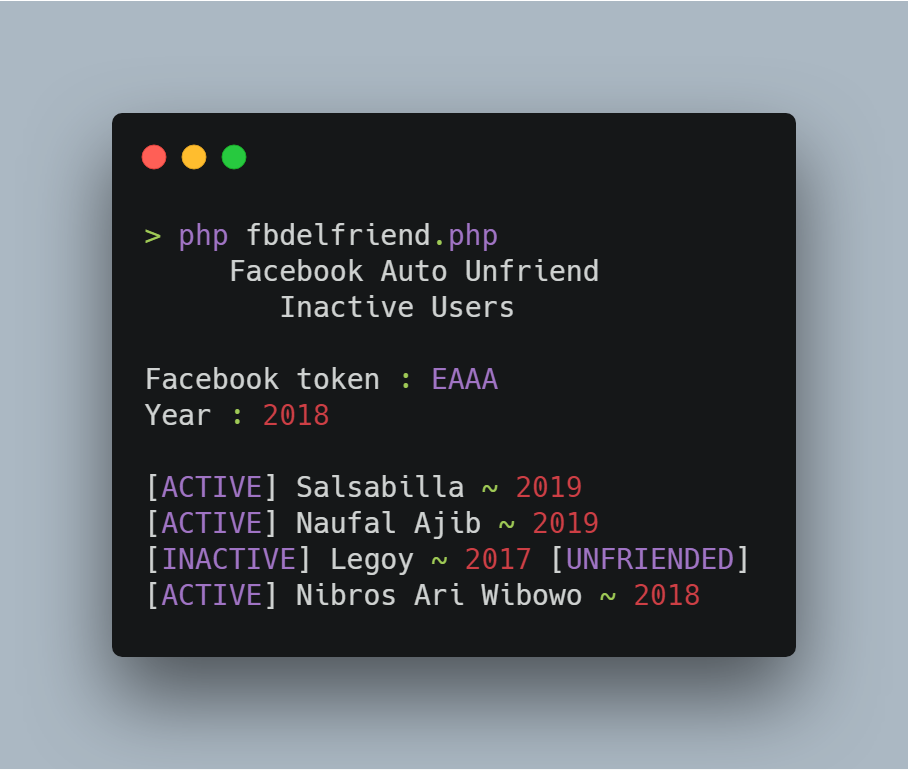

# FacebookUnfriend
Unfriend inactive users

© JANTER https://pastebin.com/kbsCFyAs

Recode by Dandy

## Install
      $ pkg install php
      $ git clone https://github.com/dandyraka/FacebookUnfriend.git
      $ cd FacebookUnfriend

## Run
      $ php unfriend.php

## Updating
      $ git pull --force

## Explanation :
- Input :
    - Facebook token `your facebook token (EAAAAA...)`
    - Year `Ex : 2018, unfriend users where doesn't update status before 2018`

